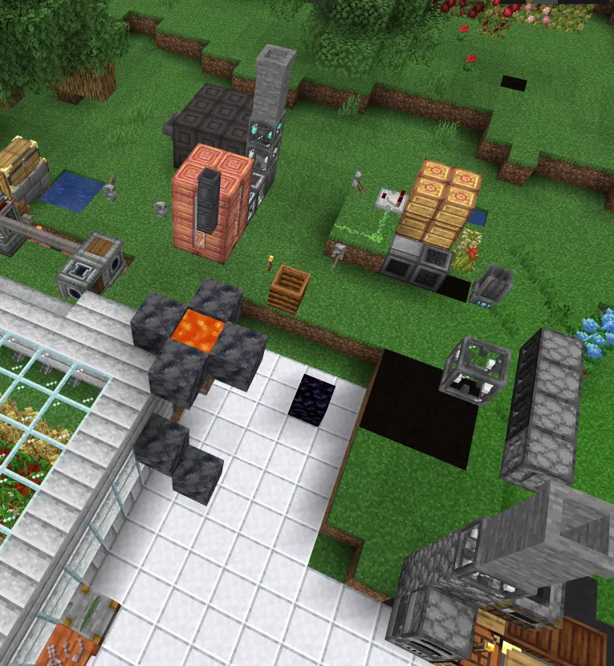
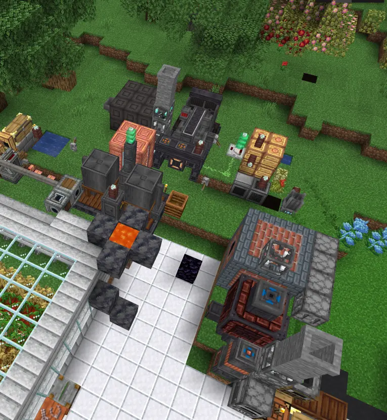

# BlueMap Model Addon

An addon for [BlueMap](https://github.com/BlueMap-Minecraft/BlueMap) that allows [BlueMapModelLoaders](https://github.com/Uiniel/BlueMapModelLoaders) to render various modded blocks and machines. *(So basically it's an addon for BMML but also for BlueMap so... you know...)*

## Supported Mods

For now only IE and only partially:P

- [Immersive Engineering](https://www.curseforge.com/minecraft/mc-mods/immersive-engineering) [tested with version `10.2.0-183` for MC 1.20.1]

### Planned Support

- Create
- Refined Storage?
- Chiseled

| **Without this addon** | **With this addon** |
| --- | --- |
|  |  |

## Requirements

- [BlueMap](https://github.com/BlueMap-Minecraft/BlueMap) version 5.10 or newer
- [BlueMapModelLoaders](https://github.com/Uiniel/BlueMapModelLoaders) [tested with version `0.3.2`]

## Installation

Install alongside BlueMapModelLoaders in the `packs` folder of BlueMap config.
